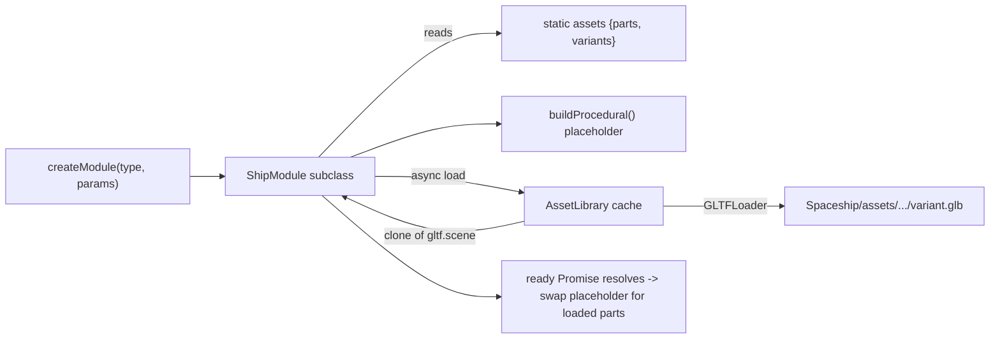

# Asset usage in modules

## Motivation

Today every ship module generates its 3D representation procedurally inside `build()` (see `Spaceship/js/modules/Cockpit.js` for the canonical example).
This is fast to iterate on and gives us free dynamic behavior — wider cockpits grow more windows, taller fuel tanks get more reinforcement bands, etc. — but it limits our ability in terms of achieving specific visual styles and high visual fidelity.

We  want to make this configurable so that artists can create module geometries in a CAD package (Blender, etc.) and drop it into the project as glTF(s), **without** throwingaway the procedural flexibility we already have. The two approaches should coexist inside the same module.

## Design at a glance

- A module can mix imported glTF parts with procedurally generated geometry (**hybrid**).
- A module declares a list of *part slots*; each slot offers one or more *variants* the user can pick (**composition + variants**).
- Asset parts render at their authored size. **Dynamic scaling for asset parts is out of scope** for this iteration — see [Out of scope](#out-of-scope).



## Asset directory layout

All glTF assets live under a new top-level folder:
```
Spaceship/assets/
  <moduleType>/
    manifest.json
    <part>/
      <variant>.glb
```

For example:

```
Spaceship/assets/
  cockpit/
    manifest.json
    hull/
      hull_classic.glb
      hull_blunt.glb
    canopy/
      canopy_dome.glb
      canopy_slit.glb
```

`manifest.json` is the source of truth for what variants exist and how they
should be treated:

```json
{
  "parts": {
    "hull": {
      "default": "hull_classic",
      "variants": {
        "hull_classic": { "displayName": "Classic Hull", "thumbnail": "hull_classic.png" },
        "hull_blunt":   { "displayName": "Blunt Hull",   "thumbnail": "hull_blunt.png" }
      }
    },
    "canopy": {
      "default": "canopy_dome",
      "variants": {
        "canopy_dome": {
          "displayName": "Dome Canopy",
          "thumbnail": "canopy_dome.png",
          "attach": [0, 0.4, 0],
          "tintable": ["glass"]
        },
        "canopy_slit": {
          "displayName": "Slit Canopy",
          "thumbnail": "canopy_slit.png",
          "attach": [0, 0.4, 0.1],
          "tintable": ["glass"]
        }
      }
    }
  }
}
```

Per-variant fields:

- `displayName` — label shown in the variant dropdown.
- `thumbnail` — optional PNG sibling for the inventory/properties UI.
- `attach` — optional `[x, y, z]` offset applied to the cloned scene root
  before parenting it into the module. Lets authors keep glTF origins at the
  natural mesh center while still aligning parts.
- `tintable` — optional list of glTF material names that `setColor()` is
  allowed to recolor. If omitted, no asset materials are tinted (CAD-authored
  materials are preserved as-is).

## Module declaration API

Modules opt into asset usage by adding a `static assets` block next to the
existing `static meta` (see `Spaceship/js/modules/registry.js` for the
metadata convention):

```js
export class Cockpit extends ShipModule {
    static meta = {
        name: 'Cockpit',
        icon: 'rocket',
        description: 'Command module with viewport',
        hotkey: '2'
    };

    static assets = {
        parts: {
            hull:   { slot: 'body' },
            canopy: { slot: 'top'  }
        }
    };

    buildProcedural() {
        // Windows still placed in code so they can react to width.
        const { width, height, depth } = this.params;
        // ...existing per-window loop...
    }
}
```

The `assets.parts` keys must match the part folder names under`Spaceship/assets/<moduleType>/`. The runtime list of variants and their metadata comes from `manifest.json`, **not** from the JS — so adding a new variant is a content-only change with no code edit required.

The optional `slot` field is a hint for layout but has no enforced meaning in this iteration; it's included so authors can document intent.

## Hybrid `build()` flow

`ShipModule.build()` becomes a small orchestrator. The current procedural body of each subclass moves into a new `buildProcedural()` hook, and the base class drives both phases:

```js
// ShipModule.js (sketch)
build() {
    this.parts = {};
    const assets = this.constructor.assets;

    // Phase 1: procedural placeholder + procedural detail.
    this.buildProcedural();

    if (!assets) {
        this.ready = Promise.resolve(this);
        return;
    }

    // Phase 2: async asset load.
    this.ready = AssetLibrary.loadModuleParts(this.type, this.params.parts)
        .then(loaded => {
            this.removePlaceholder();
            for (const [partName, sceneClone] of Object.entries(loaded)) {
                const group = new THREE.Group();
                group.name = partName;
                group.add(sceneClone);
                this.parts[partName] = group;
                this.add(group);
            }
            this.applyColorToAssetParts();
            return this;
        });
}
```

Subclasses implement `buildProcedural()` for anything that should always be generated in code (e.g. cockpit windows). Subclasses with **no** asset declaration keep behaving exactly as today — `buildProcedural()` does all the work and `ready` resolves immediately.

A small helper `removePlaceholder()` strips children that were tagged `module.userData.placeholder = true` during the procedural phase, so authors can decide which procedural meshes are placeholders (removed once the asset arrives) vs. permanent detail (kept alongside the asset).

## AssetLibrary loader / cache

A new singleton at `Spaceship/js/assets/AssetLibrary.js` wraps three.js' `GLTFLoader` (already in the repo at [examples/jsm/loaders/GLTFLoader.js](examples/jsm/loaders/GLTFLoader.js)):

- **One loader instance** for the whole app.
- **Manifest cache** — `manifest.json` per module type is fetched once and memoized.
- **Scene cache** — each `.glb` is parsed once; subsequent requests return `SkeletonUtils.clone(gltf.scene)` so multiple module instances share GPU buffers but get independent transforms.
- **In-flight dedupe** — concurrent requests for the same URL return the same Promise.
- **API**:
  - `AssetLibrary.getManifest(moduleType): Promise<Manifest>`
  - `AssetLibrary.loadVariant(moduleType, part, variant): Promise<Object3D>`
  - `AssetLibrary.loadModuleParts(moduleType, partsParams): Promise<Record<string, Object3D>>`
    — resolves chosen variants from `partsParams` (falling back to the
    manifest's `default`), loads them in parallel, and returns a map of
    `{ partName: clonedScene }`.

## Sync construction + `ready` Promise

`createModule(type, params)` in
[Spaceship/js/modules/registry.js](Spaceship/js/modules/registry.js) **stays synchronous** and continues to return a fully usable `THREE.Group`. Existing call sites do not need to change:

- `Spaceship/js/main.js` (placement, preview, paste)
- `Spaceship/js/Storage.js` (deserialize)
- `Spaceship/js/commands/AddCommand.js`
- `Spaceship/js/commands/RemoveCommand.js`

The module is renderable immediately via its procedural placeholder; when `module.ready` resolves the placeholder is swapped for the loaded asset parts. Code that wants to react to load completion (e.g. a future "finalize export" path) can `await module.ready`.

## Color / material tinting rules

`ShipModule.setColor(hexColor)` keeps its current behavior for procedural geometry — it traverses children and recolors every material. For asset parts the rule is stricter so we don't paint over authored PBR materials:

- For each loaded part, look up the variant's `tintable` list in the manifest.
- Only materials whose `material.name` is in that list are recolored.
- If `tintable` is omitted, **no** asset materials are tinted.
- A material referenced by an asset is cloned on first tint so multiple instances with different colors don't share state.

Procedural pieces inside a hybrid module are tinted as before.

## Variant selection in UI

A new optional param `parts` is added to the module params schema:

```js
this.params = {
    width: 1, height: 1, depth: 1, color: 0x888888,
    parts: {},          // e.g. { hull: 'hull_blunt', canopy: 'canopy_dome' }
    ...params
};
```

- `params.parts` is serialized and deserialized like every other param —
  `serialize()` / `deserialize()` in `ShipModule` need no change beyond
  including the new field.
- The properties panel (`Spaceship/js/ui/`) reads
  `Module.assets.parts` plus the manifest, and renders one `<select>` per
  part slot populated from the manifest's variants. Changing a variant calls
  `module.update()` which re-runs `build()` (the existing flow), and the new
  `ready` Promise resolves once the new variant is loaded.
- Unset entries in `params.parts` resolve to the manifest's `default`.

## Backward compatibility

- Modules with no `static assets` block behave exactly as today (pure
  procedural). All existing module files keep working unchanged once their
  procedural code is renamed `build()` → `buildProcedural()`.
- Existing saves (`localStorage`, JSON exports) have no `parts` field; the
  loader treats this as "use defaults" so old ships continue to round-trip.
- No data migration is required.

## Out of scope

- Dynamic geometry rebuilds for asset parts when `width/height/depth`
  change. Asset parts render at authored size; the existing scale UI either
  hides for asset-only modules or only affects procedural pieces — to be
  decided when the implementing change lands.
- Level-of-detail (LOD) variants.
- An in-app glTF uploader / asset browser.
- glTF validation tooling in CI.
- Collision / bounds derived from glTF geometry (we keep the current grid
  cell bounds).

## Open questions

- **Thumbnails**: do we hand-author PNGs alongside each `.glb`, or write a
  small offline script that renders thumbnails from the assets at build
  time? Preference: author-supplied for v1, automate later.
- **Placeholder fidelity**: should the procedural placeholder match the
  loaded asset's bounding box (less visual pop-in) or stay as the existing
  detailed procedural mesh (richer first frame)?
- **Draco / Meshopt compression**: do we want to wire `DRACOLoader` /
  `MeshoptDecoder` from the start, or require uncompressed `.glb` for v1?
